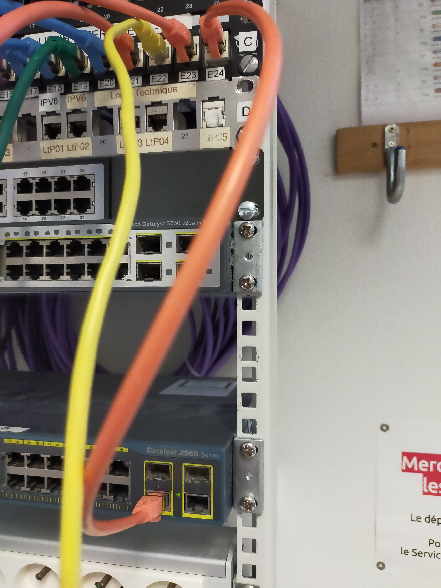

# Documentation Projet SAÉ 12

Projet réalisé par ANTOINE Maxime, BRETONNIERE Martin, COEURET Tristan, DAIRIN Come et SCHER Florian du 12 décembre 2024 au 10 janvier 2024.

# Notice Routage Statique Lan Wan

## Matérielle utilisé :

Commutateur Cisco catalyst 3750
Routeur Cisco 2911 

## Configuration de la liaison routeur box 


On relie le port Gi0/0 du routeur 2911 sur le port mural B12 à l'aide d'un cable Rg45


On récupére le port B12 sur la baie de la salle 3252 que l'on connecte au switch baie inter salle.


Dans notre cas on le branche au port 10 de la baie qui le relie a la baie salle 3250


On recupère la liaison au port 3252-C11 que l'on relie au port E23




On relie le port E24 au port tague du SWitch interbaie 3250-3258. On relie la salle 3250 au port E23


On récupére la liaison au port E24 que l'on relie au serveur proxmox au port 47


## Config Routeur 2911

```Current configuration : 2148 bytes
!
! Last configuration change at 14:59:03 UTC Wed Jan 8 2025
!
version 15.7
service timestamps debug datetime msec
service timestamps log datetime msec
no service password-encryption
!
hostname R1
!
boot-start-marker
boot-end-marker
!
!
!
no aaa new-model
memory-size iomem 15
!
!
!
ip cef
no ipv6 cef
!
multilink bundle-name authenticated
!
!
voice-card 0
!
!
vxml logging-tag
license udi pid CISCO2911/K9 sn FCZ163460SN
license accept end user agreement
license boot module c2900 technology-package securityk9
license boot module c2900 technology-package uck9
license boot module c2900 technology-package datak9
!
!         
!
redundancy
!
!
!
!
!
interface Embedded-Service-Engine0/0
 no ip address
 shutdown
!
interface GigabitEthernet0/0
 description Interface connectee a la Box
 ip address 192.168.111.54 255.255.255.192
 ip nat outside
 ip virtual-reassembly in
 duplex auto
 speed auto
!
interface GigabitEthernet0/1
 description Interface connectee au switch L3
 ip address 192.168.2.249 255.255.255.252
 ip nat inside
 ip virtual-reassembly in
 duplex auto
 speed auto
!
interface GigabitEthernet0/2
 no ip address
 shutdown
 duplex auto
 speed auto
!
interface Serial0/0/0
 no ip address
 shutdown 
 clock rate 2000000
!
interface Serial0/0/1
 no ip address
 shutdown
 clock rate 2000000
!
!
ip default-gateway 192.168.111.1
ip forward-protocol nd
!
no ip http server
no ip http secure-server
!
ip nat inside source list 1 interface GigabitEthernet0/0 overload
ip route 0.0.0.0 0.0.0.0 192.168.111.1
!
ipv6 ioam timestamp
!
!
access-list 1 permit 192.168.2.248 0.0.0.3
!
control-plane
!
 !
 !
 !
 !
!
mgcp behavior rsip-range tgcp-only
mgcp behavior comedia-role none
mgcp behavior comedia-check-media-src disable
mgcp behavior comedia-sdp-force disable
!
mgcp profile default
!
!
gatekeeper
 shutdown
!
!         
line con 0
line aux 0
line 2
 no activation-character
 no exec
 transport preferred none
 transport output lat pad telnet rlogin lapb-ta mop udptn v120 ssh
 stopbits 1
line vty 0 4
 login
 transport input none
!
scheduler allocate 20000 1000
!
end
```


## Informations Générales

Version et Date de la Configuration

Version IOS : 15.7

Taille de la Configuration : 2148 octets

Dernier changement : 8 janvier 2025 à 14:59:03 UTC

### Configuration de Base

### Horodatages (non configuré -> configuration de base):

``` service timestamps debug datetime msec ```: Active les horodatages à la milliseconde pour les messages de débogage.

``` service timestamps log datetime msec ```: Active les horodatages à la milliseconde pour les journaux.

### Nom de l'Hôte :

``` hostname R1 ```: Le routeur est nommé "R1".

### Mots de Passe (non configuré -> configuration base routeur 2911) :

```no service password-encryption ```: Les mots de passe sont stockés en texte clair.

### Gestion de la Mémoire (non modifié)

``` memory-size iomem 15 ```: Configure l’allocation de la mémoire pour les interfaces.

### Fonctionnalités et Licences 

### Gestion des Licences :

``` license udi pid CISCO2911/K9 sn FCZ163460SN ```: Identifiant unique du produit.

#### Activation des licences pour les modules suivants :

``` securityk9 ``` : Sécurité avancée.

``` uck9 ```: Communications unifiées.

```datak9 ```: Fonctionnalités avancées de gestion de données.

### IP Routing (configuration de base du routeur 2911):

``` ip cef ```: Active le Cisco Express Forwarding pour une optimisation des performances.

``` no ipv6 cef ```: Désactive le Cisco Express Forwarding pour IPv6.

### Configuration des Interfaces

### Interfaces Ethernet

#### Interface GigabitEthernet0/0 :

description Interface connectee a la Box : Connexion à la passerelle internet.

``` ip address 192.168.111.54 255.255.255.192 ```: Adresse IP et masque de sous-réseau.

``` ip nat outside ```: Définie comme interface NAT externe.

``` ip virtual-reassembly in ``` : Active la réassemblage des paquets IP.

``` duplex auto, speed auto ``` : Paramètres automatiques pour la vitesse et le duplex.

#### Interface GigabitEthernet0/1 :

description Interface connectee au switch L3 : Connexion au switch de niveau 3.

``` ip address 192.168.2.249 255.255.255.252 ``` : Adresse IP et masque de sous-réseau.

``` ip nat inside ``` : Définie comme interface NAT interne.

``` ip virtual-reassembly in ```: Active la réassemblage des paquets IP.

#### Interface GigabitEthernet0/2 pas configuré donc non utilisé donc configuartion de base du routeur :

```no ip address``` : Pas d’adresse IP configurée.

``` shutdown``` : Interface désactivée.

### Interfaces Série 

#### Interface Serial0/0/0 et Serial0/0/1 pas configuré donc non utilisé donc configuartion de base du routeur :

 ```no ip address  ``` : Pas d’adresse IP configurée.

 ``` shutdown  ```: Interfaces désactivées 

 ```clock rate 2000000  ```: Configure la vitesse d’horloge pour les connexions.

### NAT (Network Address Translation)

#### Configuration NAT :

 ``` ip nat inside source list 1 interface GigabitEthernet0/0 overload  ```: Permet le NAT avec surcharge sur l'interface externe.

#### Accès NAT :

 ```access-list 1 permit 192.168.2.248 0.0.0.3 ``` : Autorise les adresses IP de la plage 192.168.2.248/30 à utiliser le NAT.

### Routage

#### Passerelle par Défaut :

```ip default-gateway 192.168.111.1 ```: Passerelle par défaut.

#### Route Statique :

```ip route 0.0.0.0 0.0.0.0 192.168.111.1 ```: Route par défaut pointant vers 192.168.111.1.

### Services et Accès configuration non modifié configuration de base du routeur 

#### Serveurs HTTP :

```no ip http server ```: Serveur HTTP désactivé.

``` no ip http secure-server ```: Serveur HTTPS désactivé.

#### Plan de Contrôle :

control-plane : Protège le plan de contrôle du routeur contre les abus.

#### Lignes de Contrôle :

```line con 0 ```: Configuration de la console physique.

```line vty 0 4 ```: Configuration des accès à distance (Telnet/SSH).

```login``` : Nécessite une authentification.

```transport input none``` : Aucun protocole d’accès à distance activé.

Paramètres Avancés

#### VoIP :

```mgcp profile default ```: Active le protocole MGCP avec le profil par défaut.

#### Planification des Tâches :

``` scheduler allocate 20000 1000 ```: Alloue des ressources au planificateur.


## Configue SWR1
```
interface FastEthernet1/0/5
 description Vers routeur
 no switchport
 ip address 192.168.2.250 255.255.255.252
!
```

L'interface FastEthernet1/0/5 est configurée pour établir une connexion vers un routeur. Elle est définie comme une interface L3 (routage activé) et non une interface de commutation (mode no switchport).

```description Vers routeur``` : Fournit une annotation pour l'interface, utile pour identifier son rôle dans la topologie réseau.

```no switchport```: Configure l'interface en mode L3 (routage activé). Cela désactive le mode L2 (commutation).

```ip address 192.168.2.250 255.255.255.252``` : Attribue une adresse IP et un masque de sous-réseau.

```192.168.2.250 ``` : Adresse IP attribuée à l'interface.
``` 255.255.255.252 ```: Masque de sous-réseau, définissant un sous-réseau point-à-point (seulement 2 adresses utilisables).

``` ip route 0.0.0.0 0.0.0.0 192.168.2.249 ```

```ip route 192.168.111.0 255.255.255.0 192.168.0.249 ```

###  Route par défaut (Default Route)

```ip route 0.0.0.0 0.0.0.0 192.168.2.249 0.0.0.0 0.0.0.0 ``` : Définit une route par défaut.
Elle est utilisée pour router tous les paquets qui ne correspondent à aucune autre route dans la table de routage.

```192.168.2.249 ```: Adresse IP de la passerelle (next hop), qui est généralement l'adresse d'une interface sur un routeur amont.

Utilité : Cette route permet à l'appareil d'acheminer tout trafic vers une destination inconnue en direction de la passerelle.

#### Route statique spécifique

```ip route 192.168.111.0 255.255.255.0 192.168.0.249 192.168.111.0 255.255.255.0 ``` : Spécifie un sous-réseau de destination particulier.

```192.168.111.0/24 ``` : Le réseau cible.
```192.168.0.249 ```: Passerelle pour atteindre le réseau cible.

Utilité : Cette route est utilisée pour envoyer du trafic destiné au réseau 192.168.111.0/24 vers la passerelle 192.168.0.249.

Groupe 1 TP 2.2