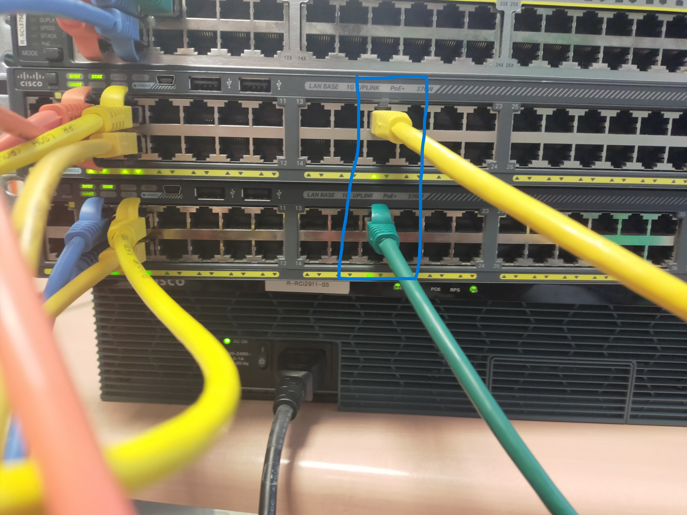
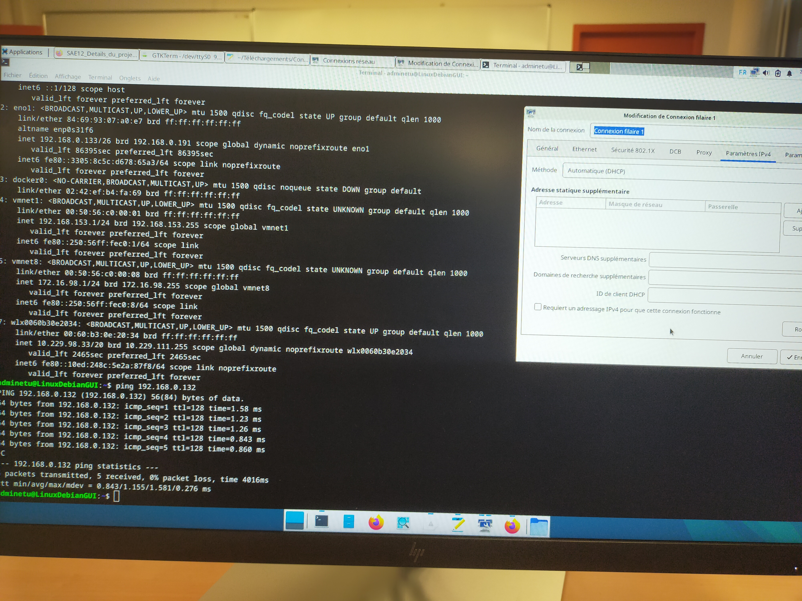

# Documentation Projet SAÉ 12
Projet réalisé par ANTOINE Maxime, BRETONNIERE Martin, COEURET Tristan, DAIRIN Come et SCHER Florian
du 12 décembre 2024 au 10 janvier 2024.

## Test

On se branche sur le vlan130 qui comprends les adresse IP de 192.168.0.132 - 192.168.0.190

On voit que en eno1 192.168.0.133 appartient bien a la plage IP du vlan140
On effectue un ping vers un ordinateur du même vlan. 100 % renvoyés donc la liaison inter-vlan fonctionne .

Groupe1 Tp2.2