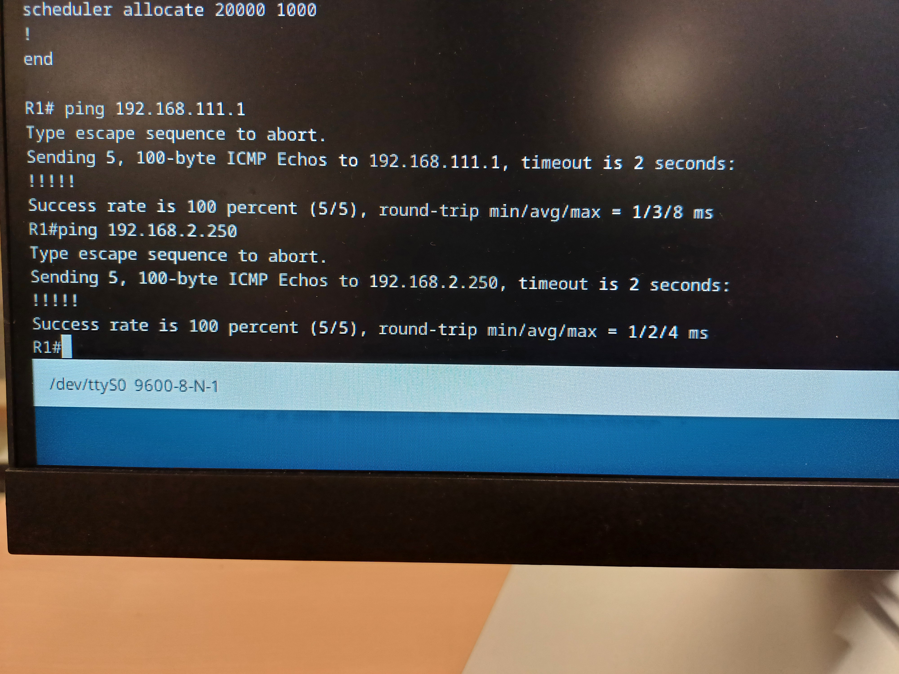

# Documentation Projet SAÉ 12

Projet réalisé par ANTOINE Maxime, BRETONNIERE Martin, COEURET Tristan, DAIRIN Come et SCHER Florian du 12 décembre 2024 au 10 janvier 2024.

## Test

On ping la boxe depuis le Routeur R1. 100 % des paquets sont renvoyés la liaison marche

On ping la boxe depuis le SWR1. 100 % des paquets sont renvoyés la liaison marche

Groupe1 TP2.2